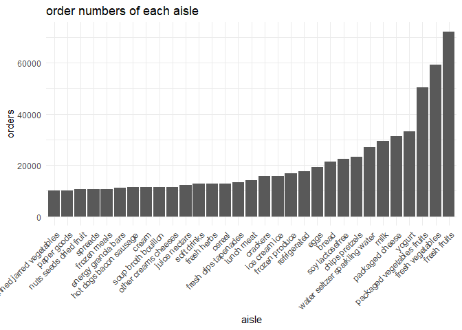

hw3_P8105_hr2569
================
Hongzhu Ren
2023-10-11

# Problem 1

``` r
data("instacart")
```

This dataset contains 1384617 data of 15 variables, consisting of
*order_id, product_id, add_to_cart_order, reordered, user_id, eval_set,
order_number, order_dow, order_hour_of_day, days_since_prior_order,
product_name, aisle_id, department_id, aisle, department*.

Each data illustrates a specific order, containing id of order, product,
user, ailse and department. order_dow, order_hour_of_day,
days_since_prior_order describe the order time. reorder=1 indicates this
this product has been ordered by the user in the past.

``` r
aisle_uni <- instacart |> 
  pull(aisle) |> 
  unique()

aisle_order <- instacart |> 
  group_by(aisle) |> 
  summarize(
    orders = length(unique(order_id))
  ) |> 
  arrange(desc(orders))
```

In total there are *134* aisles, the aisles with most items orderer is
*fresh fruits*

``` r
aisle_order |> 
  filter(orders > 10000)|> 
  mutate(
    aisle = fct_reorder(aisle, orders) # order aisles with ascending order of order numbers
  ) |> 
  ggplot(aes(x = aisle, y = orders))+
  geom_bar(stat = "identity")+
  labs(
    title = "order numbers of each aisle"
  )+
  theme_minimal() +
  theme(axis.text.x = element_text(angle = 45, hjust = 1)) # rotate x-axis labels
```

<!-- -->

``` r
items_order = instacart |> 
  filter(
    aisle %in% c("baking ingredients","dog food care","packaged vegetables fruits")
  ) |> 
  group_by(aisle, product_name) |> 
  summarise(
    orders = length(unique(order_id)) # calculate orders of each items
  ) |> 
  ungroup() |> 
  group_by(aisle) |> 
  arrange(desc(orders)) |> 
  slice_head(n = 3) # select items in each groups with top three orders
```

    ## `summarise()` has grouped output by 'aisle'. You can override using the
    ## `.groups` argument.

``` r
knitr::kable(items_order)
```

| aisle                      | product_name                                  | orders |
|:---------------------------|:----------------------------------------------|-------:|
| baking ingredients         | Light Brown Sugar                             |    499 |
| baking ingredients         | Pure Baking Soda                              |    387 |
| baking ingredients         | Cane Sugar                                    |    336 |
| dog food care              | Snack Sticks Chicken & Rice Recipe Dog Treats |     30 |
| dog food care              | Organix Chicken & Brown Rice Recipe           |     28 |
| dog food care              | Small Dog Biscuits                            |     26 |
| packaged vegetables fruits | Organic Baby Spinach                          |   9784 |
| packaged vegetables fruits | Organic Raspberries                           |   5546 |
| packaged vegetables fruits | Organic Blueberries                           |   4966 |

``` r
items_time <- instacart |> 
  filter(
    product_name %in% c("Pink Lady Apples","Coffee Ice Cream")
  ) |> 
  group_by(order_dow, product_name) |> 
  summarise(
    mean_hour = mean(order_hour_of_day)
  ) |> 
  pivot_wider(
    names_from = "product_name",
    values_from = "mean_hour"
  ) |> 
  round(digits = 2) |> 
  t()
```

    ## `summarise()` has grouped output by 'order_dow'. You can override using the
    ## `.groups` argument.

``` r
knitr::kable(items_time)
```

|                  |       |       |       |       |       |       |       |
|:-----------------|------:|------:|------:|------:|------:|------:|------:|
| order_dow        |  0.00 |  1.00 |  2.00 |  3.00 |  4.00 |  5.00 |  6.00 |
| Coffee Ice Cream | 13.77 | 14.32 | 15.38 | 15.32 | 15.22 | 12.26 | 13.83 |
| Pink Lady Apples | 13.44 | 11.36 | 11.70 | 14.25 | 11.55 | 12.78 | 11.94 |
